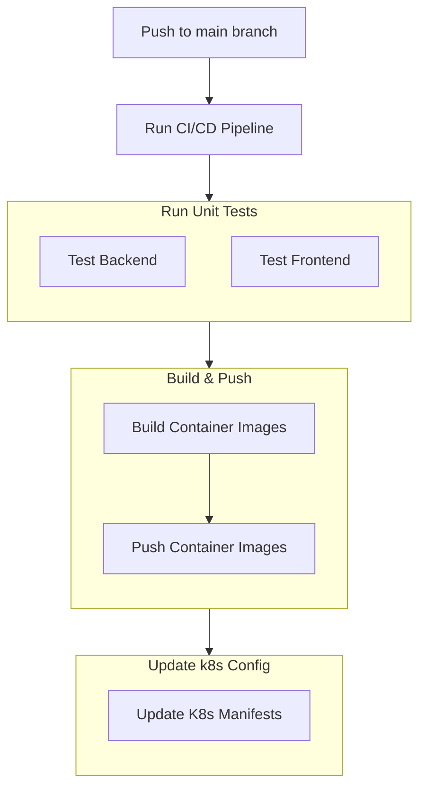

# Fullstack Next.js with PostgreSQL & Golang all Dockerized

## Prerequisites

- Docker installed
- GO installed

## How to run locally

- Clone the repository
- Run `docker compose build` in the root directory
- Run `docker-compose up -d goapp` in the root directory
- Run `docker-compose up -d nextapp` in the `frontend` directory
- Run `docker exec -it db psql -U postgres` in the terminal to access the database
- Type `\l` to list all databases
- Type `\dt` to list all tables
- Type `select * from users;` to see the users table
- Go to `http://localhost:3000` in the browser to see the frontend

## How to stop

- Run `docker-compose down` in the root directory
- Type `exit` in the terminal to exit the database

### CI/CD Flow

On every push to main ( currently `ci` branch is configured for testing ), we trigger a github workflow that run unit tests ( added testcases to upstream ), build and push contianer images, then finally update the image in [k8s-config](https://github.com/dimpu47/k8s-config) repo.

